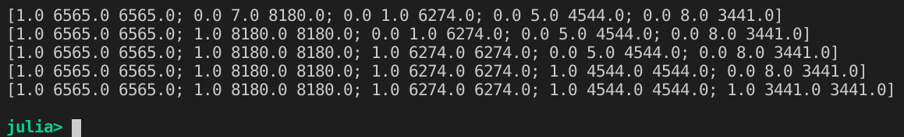

```{r setup, include=FALSE}
knitr::opts_chunk$set(
  collapse = TRUE,
  comment = "#>",
  fig.path = "./figures/"
)
knitr::knit_engines$set(julia = JuliaCall::eng_juliacall)
options(JULIA_HOME = "/home/dreth/julia/bin")
```


#### Importing libraries

```{r, echo=TRUE, warning=FALSE, message=FALSE}
library(dplyr)
library(Rcpp)
library(JuliaCall)
```

#### Importing data as described by exercise

```{r, echo=TRUE, warning=FALSE, message=FALSE}
d <- read.csv("../../datasets/Colleges.csv")
```

#### Replacing binary variable Private with 1 and 0

```{r, echo=TRUE, warning=FALSE, message=FALSE}
d$Private <- ifelse(d$Private == "Yes", 1, 0)
```

#### Selecting columns

```{r, echo=TRUE, warning=FALSE, message=FALSE}
data <- d %>% dplyr::select('Private','Apps','Accept','Enroll','F.Undergrad')
```

#### Calculating covariances

```{r, echo=TRUE, warning=FALSE, message=FALSE}
cov_matrix <- cov(data)
cov_matrix
```

\newpage

#### Calculating correlations

```{r, echo=TRUE, warning=FALSE, message=FALSE}
corr_matrix <- cov2cor(cov_matrix)
corr_matrix
```

#### Experimenting a little bit with the private variable

Let's try changing the Yes to 0 and the No to 1 and checking the covariances and correlations

```{r, echo=TRUE, warning=FALSE, message=FALSE}
d <- read.csv("../../datasets/Colleges.csv")
d$Private <- ifelse(d$Private == "Yes", 0, 1)
data <- d %>% dplyr::select('Private','Apps','Accept','Enroll','F.Undergrad')
```

```{r, echo=TRUE, warning=FALSE, message=FALSE}
cov_matrix <- cov(data)
cov_matrix
corr_matrix <- cov2cor(cov_matrix)
corr_matrix
```

We get the same numbers with reversed signs.

\newpage

### We define the following function (in julia) to help our understanding:
    
Takes the arguments:

    - nrows: number of data to simulate (amount of rows)
    - simulations: number of different times to simulate and average the results
    - fixed_value_col: boolean parameter with true -> assigns a set of values between mins[1] and maxs[1] (other 2 parameters)
    - reverse: boolean parameter that determines whether the 0s in the binary variable are assigned to the higher values or not
    - sim_binaries: this would simulate a rolling proportion of binaries where iteration 1 has all zeros in the binary variable and iteration *nrows* has all 1s in the binary variable
    - mins: array containing as first element the minimum value to use for corresponding values in the quantitative columns with 1s and 0s assuming the fixed_value_col parameter is set to false, if it's set to true then it'll be the minimum of the quantitative variable we are calculating the covariance or correlation vs the quantitative variable. the second element of the array represents the same minimum but for the 2nd array which will substitute the values of elements that are 1 or 0 depending on the user choice. (for example: if reverse=false, fixed_value_col=false, maxs=[10,10000] and mins=[1,100],  the values in the quantitative variable corresponding to 1s in the binary variable will, as the loop goes on, go from having minimum value 1 to minimum value 100 and with will go from having maximum value 10 to maximum value 10000, therefore assigning high values (between 100-10000) to elements in the quant.variable corresponding to 1 in the binary variable and keep lower values (between 1-10) for the ones corresponding to 0s in the binary variable)
    - maxs: same as minimum but they're the maximums.

Example of how the dataset changes for a run of the function with parameters: nrows=5, simulations=1 and the rest of the parameters as default:



In Figure 1 we can see 5 iterations (as there's 5 simulated rows) using the function, where the leftmost value of each row is a binary variable (1 or 0), starting with (1,0,0,0,0) and ending with (1,1,1,1,1), and for our quantitative variable (with which we will calculate cov/corr) we can see the values go from a high value (copied from the 3rd column) and the rest of values being small (6565,7,1,5,8) and ending with large values (copied from column 3) being (6565, 8180, 6214, 4544, 3441). 

### Function definition

```{julia}
using Random
using Statistics
using Plots
gr()

function simulation_general(nrows, simulations; fixed_value_col=false, 
    reverse=false, sim_binaries=true, mins=[1,100], maxs=[10,10000]) 
    # cov and corr matrixes
    covs = zeros(Float64, nrows, simulations)
    corr = zeros(Float64, nrows, simulations)

    # loop
    for s in 1:simulations
        pvtapps = zeros(Float64, nrows, 3)
        if sim_binaries == false
            pvtapps[:,1] = rand(0:1, nrows)
        end

        # random numbers column (quant variable)
        if fixed_value_col == true
            pvtapps[:,2] = rand(mins[1]:maxs[1],nrows)
        else
            if reverse == false
                pvtapps[:,2] = rand(mins[1]:maxs[1],nrows)
                pvtapps[:,3] = rand(mins[2]:maxs[2],nrows)
            else 
                pvtapps[:,3] = rand(mins[1]:maxs[1],nrows)
                pvtapps[:,2] = rand(mins[2]:maxs[2],nrows)
            end
        end

        # loop for changing values
        for i in 1:nrows

            # rolling binary proportions
            if sim_binaries == true
                pvtapps[1:i,1] = ones(i)
            end

            # replacing values by larger/smaller ones in col2
            if fixed_value_col == false
                pvtapps[1:i,2] = pvtapps[1:i,3]
            end
            # calculate corr and cov
            covs[i,s] = cov(pvtapps[:,1],pvtapps[:,2])
            corr[i,s] = cor(pvtapps[:,1],pvtapps[:,2])
        end
    end

    # results
    covsrows = zeros(Float64, nrows)
    corrrows = zeros(Float64, nrows)
    for i in 1:nrows
        covsrows[i] = mean(covs[i,:])
        corrrows[i] = mean(corr[i,:])
    end

    # return matrixes
    return covsrows, corrrows
end
```

```{julia}
covsrows, corrrows = simulation_general(500,200, reverse=false, sim_binaries=true);
```

\newpage

### Covariance plots with 500 data points and 200 simulations averaged

#### First scenario: larger numbers correspond to 1s

```{r, echo=TRUE, warning=FALSE, message=FALSE}
covsrows <- JuliaCall::julia_eval("covsrows")
plot(covsrows)
```

Each point here corresponds to one iteration of the function (leftmost being an iteration where the binary variable had its first value as 1 and the rest as 0 and rightmost being all 1s). For each 1 in the binary variable we have a value between 100 and 10000 in the quantitative variable used to calculate the covariance. For each 0 we have a value between 1 and 10, therefore, all values in the quantitative variable corresponding to a 0 in the binary are at least an order (x10) of magnitude larger than those corresponding to a 1.

Clearly, as long as values in the quantitative variable (corresponding to 1 in the binary variable) remain significantly larger than those corresponding to 0 the 0 in the binary variable, our covariance will grow as the proportion of 1s grow, however, once we reach half and half (half 0s and half 1s in the binary variable), our function reaches its global maximum and becomes a decreasing function. 

\newpage

#### Second scenario: larger numbers correspond to 0s

The opposite thing would happen if we reverse the values, so then we would have the values corresponding to the binary variable's 1 to the smaller values (1-10) and larger values (100-10000) corresponding to the binary variable's 0.

```{julia}
covsrows_rev, corrrows_rev = simulation_general(500,200, reverse=true, sim_binaries=true);
```

```{r, echo=TRUE, warning=FALSE, message=FALSE}
covsrows_rev <- JuliaCall::julia_eval("covsrows_rev")
plot(covsrows_rev)
```

\newpage

#### Third scenario: just random data and equal proportion of 0s and 1s

Here we simulated 700 rows in 500 simulations to have a larger sample to average the rows with.

If we only simulate without considering the binary variable, so basically keeping a somewhat even amount of ones and zeros in it and randomizing the values of the quantitative variable, then we get no discernible pattern other than (at times) drops around the middle (when proportions of 0s and 1s are the same) or in the extremes (when the binary variable is only 1 or 0):

```{julia}
rand_covrows, rand_corrrows = simulation_general(700,500, 
                                        sim_binaries=false, fixed_value_col=false);
```

```{r, echo=TRUE, warning=FALSE, message=FALSE}
rand_covrows <- JuliaCall::julia_eval("rand_covrows")
plot(rand_covrows)
```

\newpage

### Correlation plot with 500 data points and 200 simulations averaged

#### First scenario: larger numbers correspond to 1s

```{r, echo=TRUE, warning=FALSE, message=FALSE}
corrrows <- JuliaCall::julia_eval("corrrows")
plot(corrrows)
```

here we can see that while values for the 1s are higher than values for the 0s and while the proportion of 0s remains larger than the proportion of 1s, the correlation stays relatively high. When the proportion of 1s becomes higher than the proportion of 0s, then the correlation starts to drop and quickly approaches zero.

The correlation has its maximum value when the binary variable is basically all zeros (only a single 1 in it) and reaches its minimum value when all the values in in the binary variable are 1s.

\newpage

#### Second scenario: larger numbers correspond to 0s

Something quite similar but contrary to the previous situation happens with correlation when the opposite scenario occurs. Basically, our minimum value will be the highest correlation (as all the correlations here are negative). The highest correlation (minimum value in the plot for the y axis) happens when all our data points in the binary variable are 1s and all the values for the quantitative variable have been replaced by higher numbers (as here, the higher values in the quantitative variables correspond to the zeros in the binary variable).

The minimum correlation (~0) is reached right at the start, when all the values for the binary variable are 0s (except for a single value).

```{r, echo=TRUE, warning=FALSE, message=FALSE}
corrrows_rev <- JuliaCall::julia_eval("corrrows_rev")
plot(corrrows_rev)
```

\newpage

#### Third scenario: just random data and equal proportion of 0s and 1s

For randomized data with different values in every simulation we get essentially the same thing we saw with covariance. No discernible pattern and the plot will change every time it's made, as it's *just random data* averaged.

```{r, echo=TRUE, warning=FALSE, message=FALSE}
rand_corrrows <- JuliaCall::julia_eval("rand_corrrows")
plot(rand_corrrows)
```

\newpage

#### Fourth scenario: quantitative variable with only negative values

Very similarly to the scenario with only positive values but the opposite. So basically our correlations are negative and we start with a lower correlation to increase rapidly and then we drop back again rapidly after the proportion of 1s and 0s is around 75% 1s and 25% 0s.

```{julia}
_, corrrows_neg = simulation_general(500,200, mins=[-100,-1000], maxs=[-10,-200]);
```

```{r, echo=TRUE, warning=FALSE, message=FALSE}
corrrows_neg <- JuliaCall::julia_eval("corrrows_neg")
plot(corrrows_neg)
```

\newpage

#### Fifth scenario: quantitative variable with only negative values (in reverse)

Essentially the same as the fourth scenario but flipped.

```{julia}
_, corrrows_neg = simulation_general(500,200, reverse=true, mins=[-100,-1000], maxs=[-10,-200]);
```

```{r, echo=TRUE, warning=FALSE, message=FALSE}
corrrows_neg <- JuliaCall::julia_eval("corrrows_neg")
plot(corrrows_neg)
```

\newpage

#### Sixth scenario: quantitative variable with both negative and positive values

Very similar to the fourth scenario but correlation drops much faster after the proportion of ones and zeros is about the same and our maximum correlation (~ -0.7) doesn't reach -1 in this case (as it does with the previous one).

```{julia}
_, corrrows_both = simulation_general(500,200, mins=[-100,-1000], maxs=[10,200]);
```

```{r, echo=TRUE, warning=FALSE, message=FALSE}
corrrows_both <- JuliaCall::julia_eval("corrrows_both")
plot(corrrows_both)
```

\newpage

#### Seventh scenario: quantitative variable with both negative and positive values (in reverse)

Very similar to the sixth scenario but opposite. In both sixth and seventh scenario, our correlations drop very rapidly when our binary variable is either (nearly) entirely 1s or 0s.

```{julia}
_, corrrows_both = simulation_general(500,200, reverse=true, mins=[-100,-1000], maxs=[10,200]);
```

```{r, echo=TRUE, warning=FALSE, message=FALSE}
corrrows_both <- JuliaCall::julia_eval("corrrows_both")
plot(corrrows_both)
```

\newpage

## What information does the sample covariance provide?

From my observations I don't think I can confidently answer this question and say that this might have an interesting deeper *meaning*. I don't really see it as clearly as it would be seen with just 2 ordinary quantitative variables. However, there is definitely a pattern, when higher values correspond to 1s and the proportion of 1s and 0s is relatively even, then we have the maximum covariance we can have, and the opposite will happen in the opposite scenario.

If we have a covariance close to 0 we can say that that it could be (according to my testing) due to:

    - There's a significantly higher amount of 0s or 1s in the binary variable

If we have a covariance that is maximized or minimized (vs other scenarios with a different proportion of 1s and 0s in the binary variable) then it could be due to a few things:
    
    - If it's maximized (vs other scenarios):
        - It could be that the higher values correspond to 1s in the binary variable
    - If it's minimized (vs other scenarios):
        - It could be that the lower values correspond to 1s in the binary variable

## What information does the sample correlation provide?

Similar to covariance, I'm not quite sure if I'm confident enough in my findings to say that I can give a profound meaning to this correlation. But I can point out a few observations:

(using only positive values) If correlation is very high (vs other scenarios) it could be (according to my observations) due to:

    - Higher values in the quantitative variable correspond to 1s in the binary variable and there's 
    more 0s than 1s in the binary variable (0s represent more than 40% of the observations)
        - In this case, correlation will be positive
    - Higher values in the quantitative variables correspond to 0s in the binary variable and there's
    more 1s than 0s in the binary variable (1s represent more than 40% of the observations)
        - In this case, correlation will be negative

(using only negative values) If correlation is very high (vs other scenarios) it could be (according to my observations) due to:

    - Same conclusions as with positive values only, however, correlation drops when the total 
    amount of 1s and 0s replace the other.

(using both positive and negative values) If correlation is very high (vs other scenarios) it could be (according to my observations) due to:

    - Same conclusions as with negative values only, however, max correlation will be lower than 
    when using only positive or only negative values.